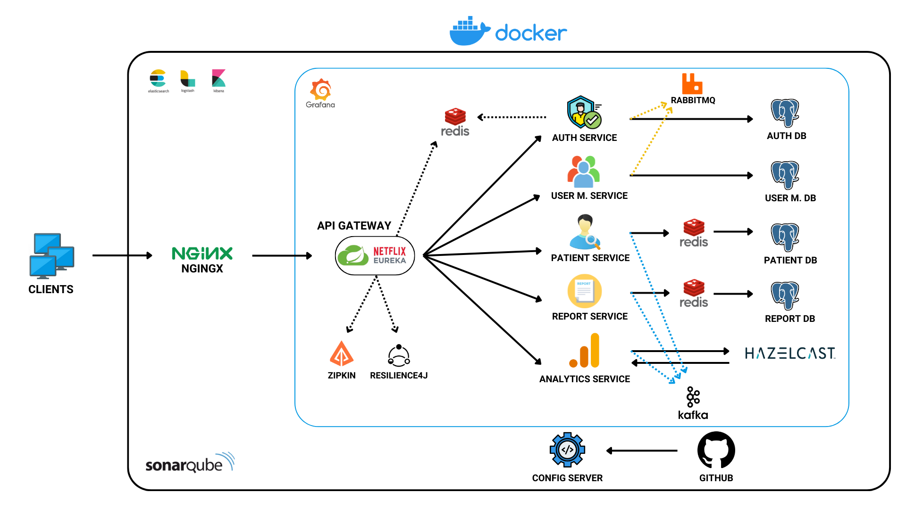
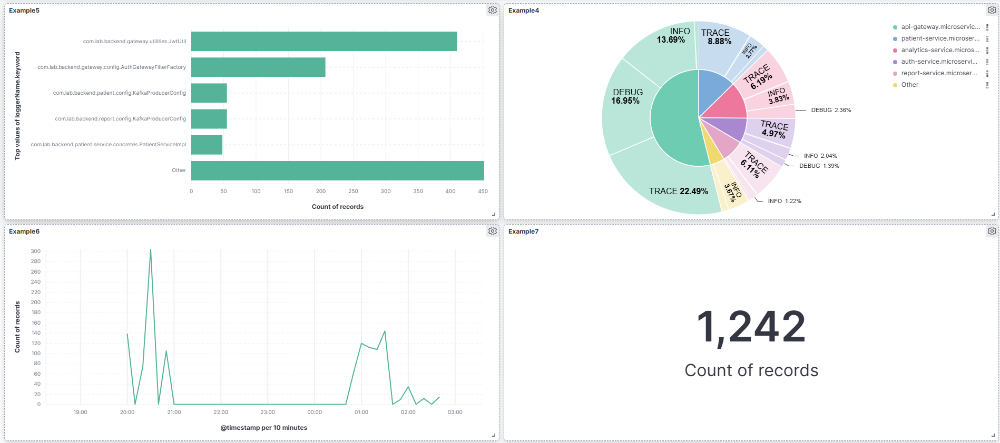
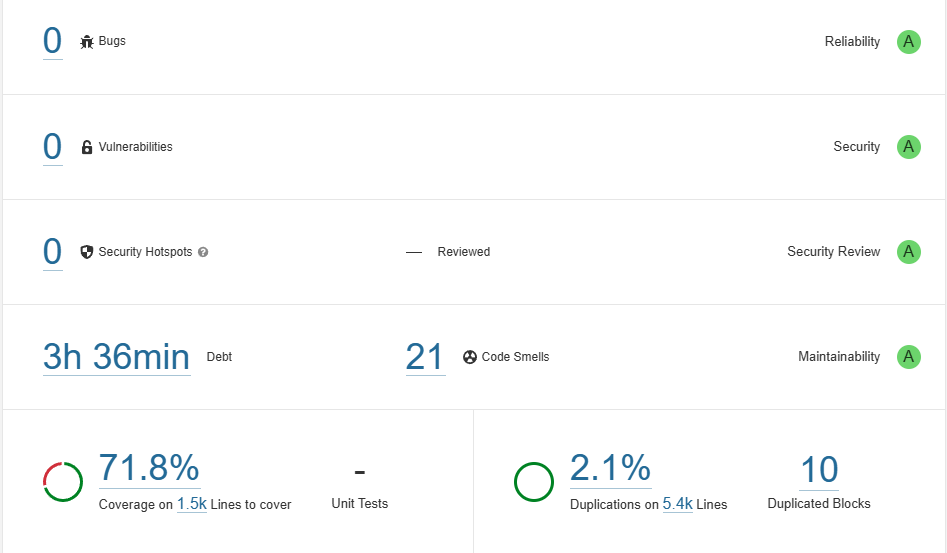

# LabReportX

## Project Description

LabReportX, a microservices-based application designed to streamline medical laboratory report production and patient
management, has been developed.

## Project Architecture



<br>

## Table of Contents

- [Technologies Used](#technologies-used)
- [Features](#features)
- [Getting Started](#getting-started)
- [Services](#services)
- [Roles & Users](#roles--users)
- [Authentication & Authorization](#authentication--authorization)
- [Endpoints](#endpoints)
- [Request Body Examples](#request-body-examples)
- [Report Example](#report-example)
- [AI Insight Example](#ai-insight-example)
- [ELK Stack Example](#elk-stack-example)
- [Importing Dashboard Samples to Kibana](#importing-dashboard-samples-to-kibana)
- [SonarQube Result](#sonarqube-result)
- [Using SonarQube for Code Quality Analysis](#using-sonarqube-for-code-quality-analysis)
- [Contact](#contact)

<br>

## Technologies Used

<table>
  <tr>
    <td>
        <ul>
          <li>Java 17</li>
          <li>Spring Boot</li>
          <li>Spring Security</li>
          <li>PostgreSQL</li>
          <li>Java JWT</li>
          <li>Docker</li>
          <li>OpenCV</li>
          <li>Spring Cloud</li>
          <li>Netflix Eureka</li>
          <li>Web Client</li>
          <li>Redis</li>
          <li>Hazelcast</li>
          <li>JUnit 5</li>
          <li>JUnit Suite Engine</li>
          <li>JaCoCo</li>
          <li>NGINX</li>
        </ul>
    </td>
    <td>
        <ul>
          <li>Log4j2</li>
          <li>Elasticsearch</li>
          <li>Logstash</li>
          <li>Kibana</li>
          <li>Micrometer</li>
          <li>Zipkin</li>
          <li>Resilience4J</li>
          <li>Google Gemini</li>
          <li>RabbitMQ</li>
          <li>Kafka</li>
          <li>JFreeChart</li>
          <li>JavaMailSender</li>
          <li>iTextPDF</li>
          <li>Prometheus</li>
          <li>Grafana</li>
          <li>SonarQube</li>
        </ul>
    </td>
  </tr>
</table>

<br>

## Features

<table>
  <tr>
    <td>
        <ul>
          <li>Token & Role Based Authentication & Authorization</li>
          <li>Microservices</li>
          <li>API Gateway</li>
          <li>Config Server</li>
          <li>Load Balancing</li>
          <li>Token Storing</li>
          <li>Caching</li>
          <li>Message Queueing</li>
          <li>Asynchronous Messaging</li>
          <li>Circuit Breaking</li>
          <li>Centralized Logging</li>
          <li>Reverse Proxy</li>
        </ul>
    </td>
    <td>
        <ul>
          <li>Web Client</li>
          <li>Distributed Tracing System</li>
          <li>Soft Deletion</li>
          <li>Pagination, Filtering & Sorting</li>
          <li>Unit Testing</li>
          <li>JavaDoc</li>
          <li>Email Sending</li>
          <li>Report Generation</li>
          <li>Prescription Generation</li>
          <li>AI Insight</li>
          <li>Static Code Analysis</li>
          <li>Data Visualization</li>
        </ul>
    </td>
  </tr>
</table>

<br>

## Getting Started

### Prerequisites

Ensure you have the following installed:

- Java 17
- Maven
- Docker

### Usage

To **start** all services defined in docker-compose.yml, use the following command:

```bash
docker-compose up -d
```

To **stop** all running services, use:

```bash
docker-compose down
```

## Services

### Config Server

A Config Server in a Spring Boot application centrally manages external configurations for all microservices. It fetches
configuration properties from a GitHub repository and serves them to various services in the architecture. This allows
for dynamic configuration management, enabling updates without redeploying individual services. By centralizing
configuration storage and distribution, the Config Server ensures consistency, scalability, and streamlined maintenance
across the entire system.

### Discovery Server

The Spring Boot Discovery Server (using Netflix Eureka or Spring Cloud's implementation) is responsible for registering
and managing all microservices in a distributed system. It acts as a central registry where each microservice registers
itself at startup and periodically sends heartbeats to indicate it's alive. Other microservices can query the Discovery
Server to find the location of these registered services, allowing dynamic and scalable communication within the
microservice architecture.

### API Gateway

An API Gateway in a Spring Boot application serves as a single entry point for all client requests to the microservices.
It routes these requests to the appropriate microservices and applies cross-cutting concerns like logging, rate
limiting, and security. When JWT authentication is included, the API Gateway also verifies the JWT token in incoming
requests, ensuring that only authenticated and authorized users can access specific services. This centralizes
authentication and routing logic, improving security and simplifying service communication within the microservice
architecture.

### Auth Service

An Auth Service in a Spring Boot application handles essential user authentication and authorization tasks. It manages
login, refresh tokens, logout, password changes, password resets, and email verification. The service securely verifies
user credentials and issues JWT tokens for authenticated access. It also facilitates token refresh to maintain sessions,
allows password updates, and supports secure password recovery through reset links. Additionally, email verification
ensures the validity of registered accounts, centralizing all key security and user management operations in a single
service.

### User Management Service

A User Management Service in a Spring Boot application handles key user administration tasks. It provides endpoints to
list users, create new user records, update user information, delete or restore users, and manage user roles. The
service allows administrators to efficiently view and manage users, including assigning and removing roles based on
permissions. This centralization of user operations helps maintain consistent user data, role-based access control, and
streamlined management in the system.

### Patient Service

A Patient Service in a Spring Boot application manages essential patient-related operations. It offers endpoints to list
patients, create new patient records, update existing patient information, delete patient records, and restore deleted
patients. This service centralizes patient data management, ensuring consistent and secure handling of patient
information within the system. It supports the efficient maintenance of patient records while allowing authorized users
to perform key operations as needed.

### Report Service

A Report Service in a Spring Boot application manages key report-related tasks. It provides endpoints to list reports,
create new reports, update existing ones, delete or restore reports, and generate reports in PDF format. Additionally,
it uses AI assistance to create prescriptions based on report data. This service centralizes report management, enabling
efficient handling, secure storage, and automated prescription creation to improve overall medical record accuracy and
usability.

### Analytics Service

The Analytics Service in Spring Boot creates charts about patients and reports. It presents a beautiful image to the user. It creates graphs with the data it receives from the patient and report service.

## Roles & Users

### Default Roles

> There are three default roles in the system:
> - SECRETARY
> - TECHNICIAN
> - ADMIN

To make requests to the relevant service, you need to have the following role.

| Service                 | Role       |
|-------------------------|------------|
| Auth Service            |            | 
| User Management Service | ADMIN      | 
| Patient Service         | SECRETARY  | 
| Report Service          | TECHNICIAN |
| Analytics Service       | ADMIN      |

### Default Users

Default users in the system.

| User            | Username        | Password     | Roles                        |
|-----------------|-----------------|--------------|------------------------------|
| SUPER User      | super           | omerasaf1899 | SECRETARY, TECHNICIAN, ADMIN |
| SECRETARY User  | ozlembalikci    | omerasaf1899 | SECRETARY                    |
| TECHNICIAN User | kadircanbalikci | omerasaf1899 | TECHNICIAN                   |
| ADMIN User      | omerasafbalikci | omerasaf1899 | ADMIN                        |

<br>

## Authentication & Authorization

> **⚠️Important:** All endpoints require a **JSON Web Token (JWT)** for authentication except auth/login,
> auth/initiate-password-reset, /auth/reset-password, /auth/verify-email, so **you need to log in first**.
> To access the endpoints, include the JWT in the Authorization header of your HTTP requests as a **Bearer token**.

An example of login request:

```json
{
  "username": "super",
  "password": "omerasaf1899"
}
```

<br>

## Endpoints

All requests should be made to the **API Gateway's URL** which is **http://localhost**. The url does **not include the
port number**.

- **URL Example** `http://localhost/auth/login`

### Auth Service

| HTTP Method | Endpoint                      | Description                        |
|-------------|-------------------------------|------------------------------------|
| GET         | /auth/refresh                 | Refresh JWT                        | 
| POST        | /auth/login                   | Authenticate user and generate JWT |
| POST        | /auth/logout                  | Logout and terminate JWT           |
| POST        | /auth/change-password         | Change password                    |
| POST        | /auth/initiate-password-reset | Initiate password reset            |
| POST        | /auth/reset-password          | Reset password                     |
| GET         | /auth/verify-email            | Verify email                       |

### User Management Service

| HTTP Method | Endpoint                    | Description                            |
|-------------|-----------------------------|----------------------------------------|
| GET         | /users/id/{id}              | Get user by ID                         |
| GET         | /users/filtered-and-sorted  | Get all users with filters and sorting |
| GET         | /users/me                   | Get current user                       |
| PUT         | /users/update/me            | Update current user                    |
| POST        | /users                      | Create a new user                      |
| PUT         | /users                      | Update user by ID                      |
| DELETE      | /users/{id}                 | Soft delete user by ID                 |
| PUT         | /users/restore/{id}         | Restore soft deleted user              |
| PUT         | /users/role/add/{userId}    | Add role to user                       |
| PUT         | /users/role/remove/{userId} | Remove role from user                  |

### Patient Service

| HTTP Method | Endpoint                        | Description                               |
|-------------|---------------------------------|-------------------------------------------|
| GET         | /patients/id/{id}               | Get patient by ID                         |
| GET         | /patients/tr-id-number          | Get patient by TR ID Number               |
| GET         | /patients/chronic-diseases/{id} | Get chronic diseases by ID                |
| GET         | /patients/filtered-and-sorted   | Get all patients with filters and sorting |
| POST        | /patients                       | Create a new patient                      |
| PUT         | /patients                       | Update patient by ID                      |
| DELETE      | /patients/{id}                  | Soft delete patient by ID                 |
| PUT         | /patients/restore/{id}          | Restore soft deleted patient              |
| GET         | /barcode/scan                   | Scan and save patient                     |
| GET         | /barcode/generate               | Generate barcode for patient              |

### Report Service

| HTTP Method | Endpoint                         | Description                                         |
|-------------|----------------------------------|-----------------------------------------------------|
| GET         | /reports/id/{id}                 | Get report by ID                                    |
| GET         | /reports/filtered-and-sorted     | Get all reports with filters and sorting            |
| GET         | /reports/me/filtered-and-sorted  | Get current user's reports with filters and sorting |
| POST        | /reports/check-tr-id             | Check TR ID Number                                  |
| POST        | /reports                         | Create a new report                                 |
| PUT         | /reports                         | Update report by ID                                 |
| DELETE      | /reports/{id}                    | Soft delete report by ID                            |
| PUT         | /reports/restore/{id}            | Restore report by ID                                |
| POST        | /reports/photo/{reportId}        | Attach photo to report                              |
| GET         | /reports/photo/{reportId}        | Get photo by report ID                              |
| DELETE      | /reports/photo/{reportId}        | Delete photo by report ID                           |
| GET         | /reports/report/{reportId}       | Generate PDF by report ID                           |
| GET         | /reports/prescription/{reportId} | Generate prescription by report ID                  |
| POST        | /reports/prescription/send       | Send prescription to email                          |

### Analytics Service

| HTTP Method | Endpoint                 | Description               |
|-------------|--------------------------|---------------------------|
| POST        | /analytics/patient-stats | Get patient density chart |
| POST        | /analytics/report-stats  | Get report density chart  |

<br>

## Request Body Examples

### Auth Service

**Endpoint:**

- **POST** `/auth/login`

```json
{
  "username": "super",
  "password": "omerasaf1899"
}
```

### User Management Service

**Endpoints:**

- **POST** `/users`

```json
{
  "firstName": "Ömer Asaf",
  "lastName": "Balıkçı",
  "username": "omerasaf",
  "email": "balikciomerasaf@gmail.com",
  "password": "omerasafbalikci1899",
  "roles": [
    "ADMIN",
    "SECRETARY"
  ],
  "gender": "FEMALE"
}
```

### Patient Service

**Endpoints:**

- **POST** `/patients`

```json
{
  "firstName": "Zehra",
  "lastName": "Ay",
  "trIdNumber": "12235566894",
  "birthDate": "1985-10-10",
  "gender": "FEMALE",
  "bloodType": "A_POSITIVE",
  "phoneNumber": "+905468795462",
  "email": "zehraay@gmail.com",
  "chronicDiseases": ["Astım"]
}
```

### Report Service

**Endpoints:**

- **POST** `/reports/check-tr-id`
- **POST** `/reports`

```json
{
  "trIdNumber": "12345678942"
}
```

```json
{
  "diagnosisTitle": "Akut Bronşit",
  "diagnosisDetails": "Hasta, bir haftadır devam eden inatçı öksürük, nefes darlığı ve hafif göğüs rahatsızlığı şikayetleri ile başvurmuştur. Zaman zaman hırıltı ve yorgunluk gözlemlenmiştir. Durumun büyük olasılıkla viral bir enfeksiyondan kaynaklandığı düşünülmektedir."
}
```

### Analytics Service

**Endpoints:**

- **POST** `/analytics/patient-stats`
- **POST** `/analytics/report-stats`

<br>

## Report Example

## Prescription Example

## Chart Example

## ELK Stack



<br>

## Grafana

## SonarQube



<br>

## 📬 Get in Touch
I'm always open to discussing new ideas, collaborations, or just having a tech chat! Feel free to reach out at:
#### 📧 Email: balikciomerasaf@gmail.com


